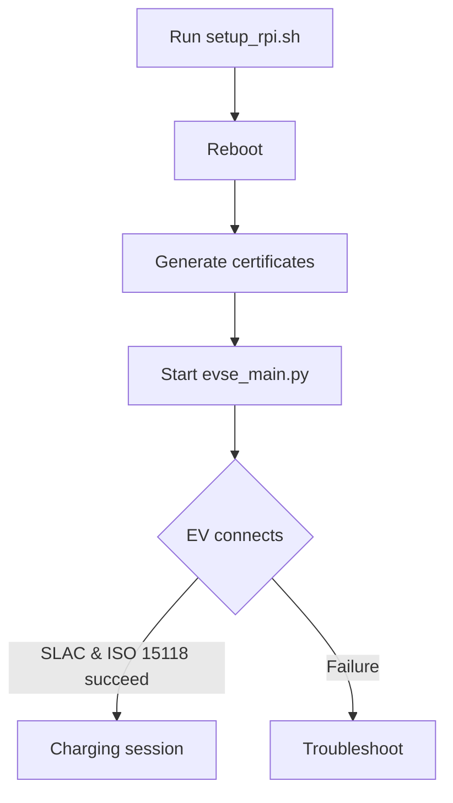

# Plug-and-Play Setup Guide

## Quick Start

1. **Run the setup script**
   ```bash
   sudo ./setup_rpi.sh
   ```
   This enables SPI, configures the QCA7000 overlay, updates submodules and installs Python dependencies. Run it on a fresh Raspberry Pi checkout.

2. **Reboot the board**
   ```bash
   sudo reboot
   ```
   The SPI interface and driver overlay are loaded only after a restart.

3. **Generate ISO 15118 certificates**
   ```bash
   ./scripts/generate_certs.sh
   ```
   Certificates are stored under `pki/` and can be regenerated at any time.

4. **Start the EVSE service**
   ```bash
   sudo python3 src/evse_main.py --evse-id <EVSE_ID>
   ```
   This bridges the PLC modem, performs SLAC matching and launches the SECC once matched.

## Troubleshooting

### SPI wiring
- Verify MOSI, MISO, SCK, CS and INT connections between the Raspberry Pi and the QCA7000 modem.
- Keep leads short (\<10 cm) and check for swapped pins.
- Confirm `/boot/config.txt` contains `dtoverlay=qca7000,int_pin=23,speed=12000000` after running the setup script.

### Interface names
- After reboot, use `ip link` to discover the PLC interface name (e.g. `eth1`, `plc0`). Update `src/iso15118/.env` if it differs from the default.
- If using a TAP bridge, ensure `tap0` exists before launching the SECC.

### IPv4/IPv6 considerations
- ISO 15118 relies on IPv6 link‑local addresses. Check with `ip -6 addr show <iface>` that one is assigned.
- If IPv4 DHCP overwrites routes, set a static IPv4 or disable DHCP on the PLC interface.
- Firewalls may block UDP traffic required for SLAC; adjust rules as needed.

## Plug-and-Play Flow


